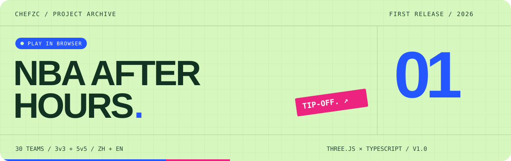
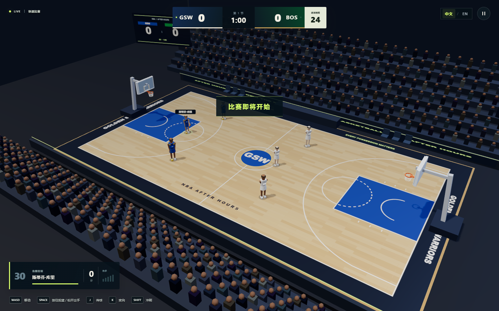
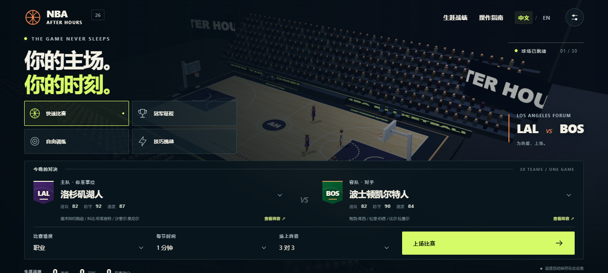

<a href="https://chefzc-homepage.vercel.app/play/nba-after-hours/"></a>

<p align="center"><a href="README.md">English</a> · <b>简体中文</b></p>
<p align="center"><a href="https://chefzc-homepage.vercel.app/play/nba-after-hours/"><b>立即上场 ↗</b></a> &nbsp; / &nbsp; <a href="https://chefzc-homepage.vercel.app/gallery.html#project-nba-after-hours">Gallery 展柜</a> &nbsp; / &nbsp; <a href="https://github.com/ChefDavid0815">认识 ChefZC</a></p>

# NBA AFTER HOURS / 决胜时刻

**为热爱，上场。**

我是 ChefZC，一名在迪拜读 IB 的 Year 12 高中生，也是篮球、库里和 2K 的爱好者。这个第一个正式项目，把对篮球的热爱变成一座自己的 3D 街机球场：单人挑战，也可以与朋友同机对战。

Three.js + TypeScript + Vite，支持中英文、键盘、手柄、触屏与本地存档，不需要账号或 API Key；也可以构建 Electron 免安装桌面版。



## 开始游戏

[在线游玩](https://chefzc-homepage.vercel.app/play/nba-after-hours/)，无需安装。建议使用开启硬件加速、支持 WebGL 2 的现代桌面浏览器；移动端有触控操作。

进度保存在当前浏览器，不属于线上账号。换设备前在设置导出长期进度；本地预览、线上网站和桌面版的存档彼此独立。

源码运行需要 Node.js 22+，按照下面命令安装依赖并启动。安装依赖后也可双击 `Start Game.cmd`，游戏期间保留启动窗口。

Windows 免安装版：`npm run package:win` 生成 `release/NBA After Hours.exe`，构建后可离线运行，无需 Node.js。存档在程序旁 `userdata`。仓库提供源码，不包含已构建的可执行文件。

## 游戏内容

| 模式 | 内容 |
| :--- | :--- |
| 快速比赛 | 3v3 / 5v5、三档 AI 难度、四节、加时或同机双人。 |
| 冠军之路 | 16 队、四轮杯赛，对阵表与跨轮续玩。 |
| 自由训练 | 选经典球员，无计时投篮；可选训练营通过实操学习移动、冲刺、投篮、完美出手和三分。 |
| 技巧挑战 | 自由 60 秒得分挑战，以及每天三项固定种子挑战，设铜银金目标。 |
| 比赛复盘 | 真实投篮位置、进/失/被盖、球员筛选、各节比分、最大领先和得分高潮。 |
| 精彩回放 | 进球后按 R 慢动作回看，回放时正式比赛计时暂停。 |
| 中途续玩 | 快速比赛和杯赛定时/暂停存档，主菜单继续未结束比赛，保留时间、球权、统计和投篮图。 |
| 备份恢复 | 设置中导出/导入长期进度；JSON 不含进行中比赛快照或即时回放缓存。 |

30 支球队，每队 5 位跨时代经典球员；3v3 可自选三人。设置、战绩、成就、杯赛和每日挑战记录保存在本机。

## 开发与构建

```powershell
git clone https://github.com/ChefDavid0815/nba-after-hours.git
cd nba-after-hours
npm ci
npm run dev
```

```powershell
npm test
npm run build
node server.mjs
```

<details>
<summary><b>翻开游戏菜单</b></summary>



</details>

## 操作

| Action / 动作 | Keyboard / 键盘 | Controller / 手柄 |
| --- | --- | --- |
| Move / 移动 | WASD / Arrow keys | Left stick |
| Sprint / 冲刺 | Shift | RT / R2 |
| Shoot, release in green / 按住投篮、绿色区间松开 | Space | A / Cross |
| Pass / 传球 | J | X / Square |
| Crossover / 突破 | K | B / Circle |
| Call screen / 呼叫挡拆 | L | Y / Triangle |
| Block (defense) / 盖帽 | Space | A / Cross |
| Steal (defense) / 抢断 | K | B / Circle |
| Switch defender / 切换防守球员 | J / Tab | X / Square / LB |
| Direct pass / 指定传球 | 1–5 | — |
| Pause / 暂停 | Esc / P | Start |
| Instant replay / 精彩回放 | R | View / Select |
| Camera / 镜头 | C | — |
| Mute / 静音 | M | — |
| Full screen / 全屏 | F | — |


双人 P2：方向键移动，U 投篮/盖帽，I 传球/切人，O 突破/抢断，右 Shift 冲刺，H 掩护，Y 切人。数字小键盘 1/2/3/5/0 也可用。一个手柄分给 P2，P1 用键盘；两个手柄分别控制 P1/P2。触屏提供摇杆与本地化动作按钮。

按住投篮约 **0.70 秒**，绿色区间松开。空位、体力、能力值与防守干扰共同影响命中。按 L 呼叫掩护，绕过后观察顺下或外弹队友。**中文 / EN** 可随时切换语言。

## 阵容与技术

球队采用跨时代幻想阵容，能力值服务游戏平衡，不是官方评级，也不代表当季名单。本项目为非官方球迷作品，与 NBA 及其球队无隶属或背书关系，名称归各自权利人。

TypeScript、Vite、Three.js；无账号、后端或 API Key。固定种子的篮球模拟独立于浏览器，规则有自动测试。球场、球员、篮球、球衣以程序绘制，音效使用 Web Audio；资产本地提供，游戏不依赖外部 CDN。构建与验收历史见 `docs/BUILD_LOG.md`。

## 验证与打包

```powershell
npm test
npm run test:e2e           # 需要 5173 端口的开发服务和 Chromium
node scripts/playtest.mjs # 对 28024 构建服务执行真实键盘决策
node scripts/electron-smoke.mjs
npm run package:win
```

浏览器测试使用本地 agent-browser Chromium 或 `NBA_CHROME` 指定路径。可用 `npx agent-browser install` 安装浏览器；新的 Electron 安装可能需要先运行 `node node_modules/electron/install.js`。

这是街机篮球，包含进攻计时、两/三分、加时、球权、传球、篮板、抢断与盖帽，并不模拟 NBA 的每一条裁判规则。
